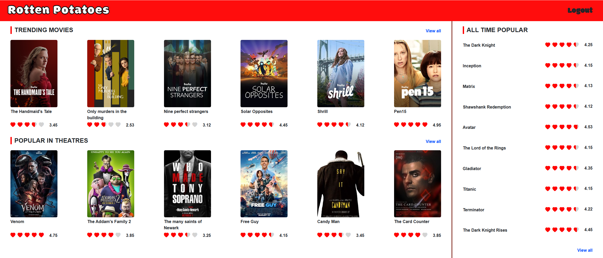
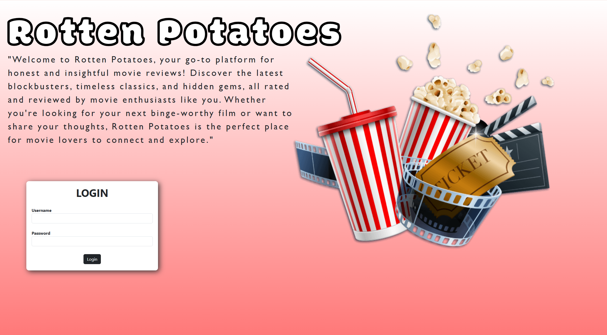
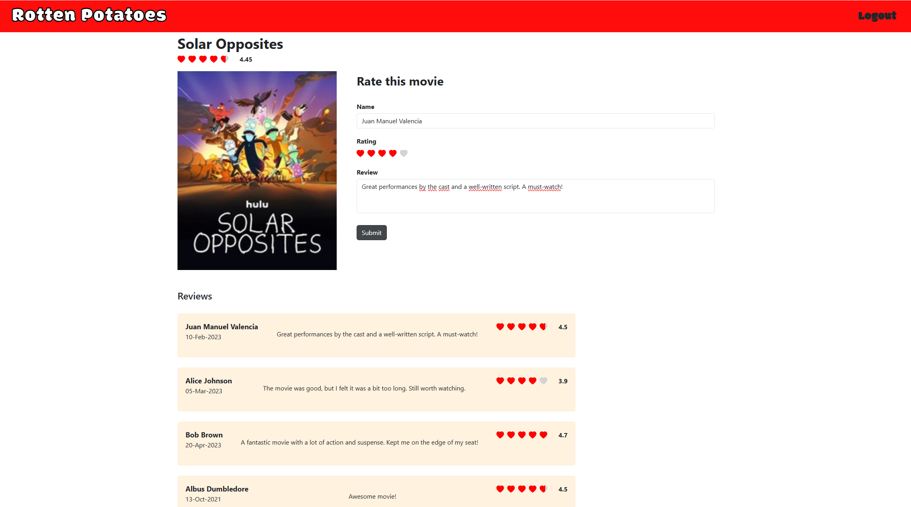

# 🎥 Rotten Potatoes 🍿

Rotten Potatoes is an **introductory project** built with **Angular** and **Bootstrap**, inspired by platforms like Rotten Tomatoes. This app allows users to:

- 🌟 Rate and rank movies.  
- 🎬 Explore trending and popular films.  
- ✍️ Post and read movie reviews.  

The project was created as a learning exercise, leveraging tutorials and hands-on experimentation to build both functionality and design.

---

## ✨ Features

1. **Interactive Movie Ratings**: Users can give ratings and view average scores.  
2. **Trending and Popular Sections**: A clean interface showcasing trending movies and popular films in theaters.  
3. **Detailed Movie Pages**: Click on any movie to see its details, user reviews, and leave your own feedback.  
4. **User-Friendly UI**: Enhanced with **Bootstrap** for a polished and responsive design.  

---

## 🛠️ Technologies Used

- **Angular**: Frontend framework for building dynamic single-page applications.  
- **Bootstrap**: Styling and layout for an intuitive user experience.  
- **HTML & CSS**: For additional structure and customization.  

---

## 🚀 How to Run

1. Clone the repository:  
   ```bash
   git clone https://github.com/your-username/rotten-potatoes.git
   ```  
2. Navigate to the project folder:  
   ```bash
   cd rotten-potatoes
   ```  
3. Install dependencies:  
   ```bash
   npm install
   ```  
4. Start the development server:  
   ```bash
   ng serve
   ```  
5. Open your browser and go to:  
   ```bash
   http://localhost:4200
   ```  

---

## 🎯 Goals

This project aims to:  
- Introduce beginners to Angular development.  
- Demonstrate the use of Bootstrap for enhancing UI design.  
- Provide a hands-on experience in building interactive web apps.  

---

## 📷 Screenshots

### Home Page  


### Login Page  
  

### Movie Details  
  

---

## 📚 Acknowledgements

This project was made possible with the help of:  
- Various **Angular tutorials** and guides.  
- **Bootstrap documentation** for UI components.  

---

## 📝 Future Enhancements

- Add authentication for user accounts.  
- Enable sorting and filtering for movie lists.  
- Implement a backend for storing reviews and ratings.  

---

## 🌟 Contributions

This is a learning project, but feedback and suggestions are always welcome! Feel free to open an issue or submit a pull request.  

---

### 📌 Disclaimer
This project was built for educational purposes only and is not affiliated with Rotten Tomatoes.  

---

Hope you enjoy exploring **Rotten Potatoes**! 🎬🍿
